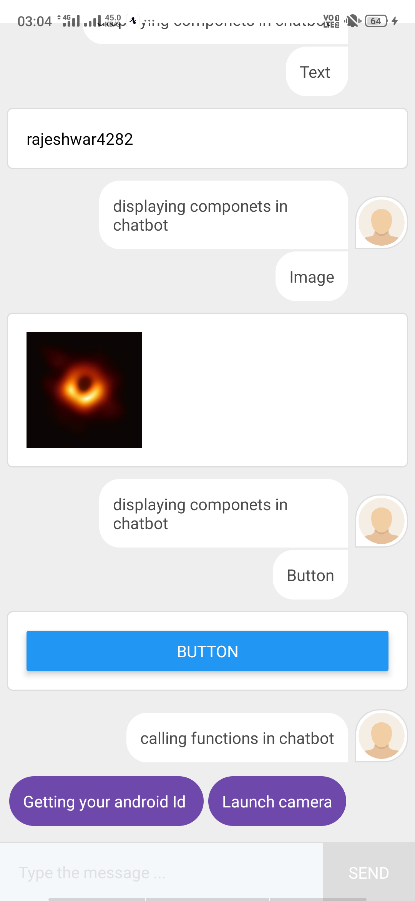

     CHATBOT IN REACTNATIVE

   
1.INSTALLING DEPENDENCIES FOR CHATBOT
  To build a chatbot in react native we have to install few dependencies 
             
         npm install react-native-chatbot
         
2.CODING FOR CHATBOT
 
         /App.js
         
   BASIC STRUCTURE FOR STEPS IN REACT-NATIVE-CHATBOT,
   
            {
             id:'1',
             message:'hello world',
            trigger:'2'
             }
   ID: it means the unique id for a step in chatbot, 
   MESSAGE: it means the data that should be displayed for that id, 
   TRIGGER: it means which step should be dispalyed after the showing of message or completion of this step. 

      Displaying components using chatbot
   STRUCTURE OF CHATBOT STEP TO DISPLAY COMPONENTS,
   
          {
         id:'1',
        component:<Text> hello world</Text>,
        trigger:'2'
        }     
   (Note:even you can both message and component at a time)
   
         Function call in react-native-chatbot
   STRUCTURE OF THE CHATBOT STEP TO CALL A FUNCTION,
   
         {
         id:'1',
         message:'hello world';
         trigger:()=>{
         console.log('calling a function')
         }   
    
    
3.RUNNING THE APP
      
        npm start
        
   &nbsp;&nbsp;&nbsp;&nbsp; 
  
  
  &nbsp;&nbsp;&nbsp;&nbsp; 
  
  &nbsp;&nbsp;&nbsp;&nbsp; 
  
  
